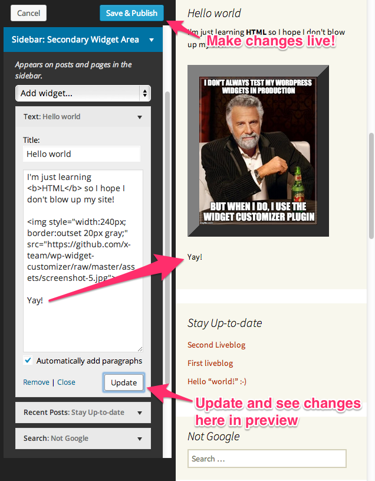
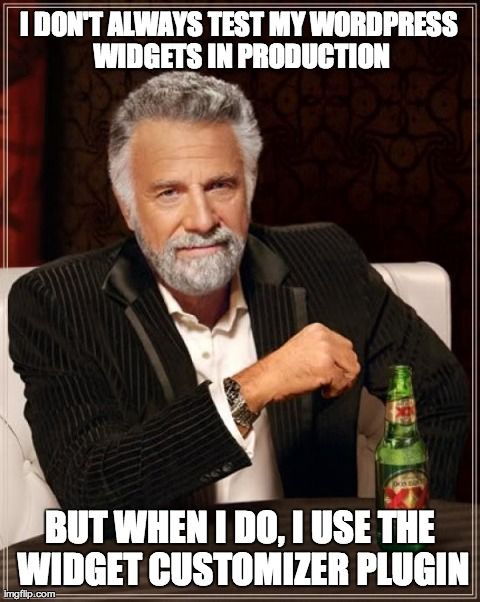

<!-- DO NOT EDIT THIS FILE; it is auto-generated from readme.txt -->
# Widget Customizer

Edit sidebar widgets in the Theme Customizer. Adds a section for each sidebar and a control for each widget.

**Contributors:** [x-team](http://profiles.wordpress.org/x-team), [westonruter](http://profiles.wordpress.org/westonruter)  
**Tags:** [customizer](http://wordpress.org/plugins/tags/customizer), [widgets](http://wordpress.org/plugins/tags/widgets), [sidebars](http://wordpress.org/plugins/tags/sidebars), [preview](http://wordpress.org/plugins/tags/preview)  
**Requires at least:** 3.7  
**Tested up to:** 3.7  
**Stable tag:** trunk (master)  
**License:** [GPLv2 or later](http://www.gnu.org/licenses/gpl-2.0.html)  

## Description ##

***IMPORTANT:*** *Currently requires applying a patch to WordPress core from [#25238](http://core.trac.wordpress.org/ticket/25238), which is marked for inclusion in next version of WordPress (3.7). This plugin will not work with WordPress 3.6 as-is if the patch is not applied.*

Widgets in WordPress provide an easy way to add functionality to predefined areas of your theme templates. However, once you add a widget to a sidebar you have to leave the WordPress admin to go back to the frontend to actually see how the updated widget appears in the sidebar on your site's public frontend. While you are making these changes and expirimenting with a widget, it could be completely broken and everyone visiting your site will see this broken widget since there is no core way to preview changes made to widgets. But WordPress also provides an excellent way to preview changes to various settings on your site via the Theme Customizer. Changes made when using the Customizer are not visible to site visitors until you hit Save & Publish. So what if widgets could be edited in the Theme Customizer? That's what this plugin makes possible.

Each registered sidebar on your site will get its own section in the Theme Customizer panel. Within each Sidebar Widgets section, each widget added to the sidebar will appear in order and its widget form will appear there just as it appears when editing widgets in the WordPress admin. Upon making a change to the widget form, press the form's Update button to then see the changes in the preview window and to stage the widget changes for committing once the Save & Publish button is clicked. Again, changes made when in the Theme Customizer do not appear until you hit this button.

No longer do you have to edit your widgets blind!

And here's an **awesome bonus**: since the widgets are registered as settings in the customizer, if you also have the [Settings Revisions](http://wordpress.org/plugins/settings-revisions/) plugin also activated, the widgets will then get versioned! Each time you save your changes, the current instance of each widget will be saved in a revision, and you can restore a previous widget state by rolling back the settings revision.

**Development of this plugin is done [on GitHub](https://github.com/x-team/wp-widget-customizer). Pull requests welcome. Please see [issues](https://github.com/x-team/wp-widget-customizer/issues) reported there before going to the plugin forum.**

## Screenshots ##

### Before changes

### After change, before save

### I DON'T ALWAYS TEST MY WORDPRESS WIDGETS IN PRODUCTION, BUT WHEN I DO I USE THE WIDGET CUSTOMIZER PLUGIN

## Changelog ##

### 0.1 ###
First Release

